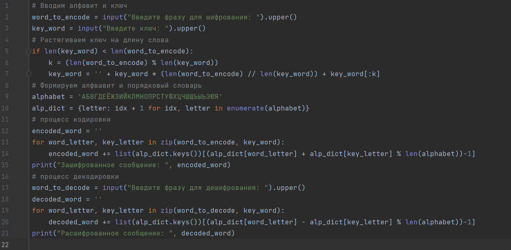
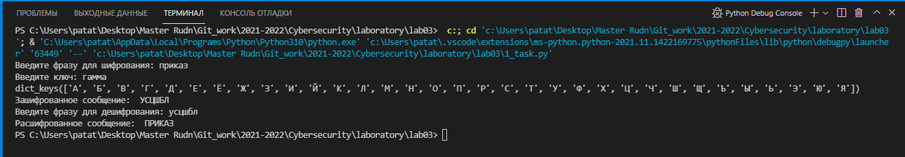

---
## Front matter
lang: ru-RU
title: Шифрование гаммированием конечной гаммой.
author: Кейела Патачона
institute: Российский Университет Дружбы Народов
date: 20 ноября, 2021, Москва, Россия

## Formatting
mainfont: PT Serif
romanfont: PT Serif
sansfont: PT Sans
monofont: PT Mono
toc: false
slide_level: 2
theme: metropolis
header-includes: 
 - \metroset{progressbar=frametitle,sectionpage=progressbar,numbering=fraction}
 - '\makeatletter'
 - '\beamer@ignorenonframefalse'
 - '\makeatother'
aspectratio: 43
section-titles: true
---

# Цели и задачи

## Цель лабораторной работы

Изучение алгоритма гаммированием конечной гаммой.

# Выполнение лабораторной работы

## Шифр гаммированием конечной гаммой
В методе гаммирования шифрование выполняется путем сложения символов исходного текста и ключа по модулю, равному числу букв в алфавите.
Если в исходном алфавите, например, 33 символа, то сложение производится по модулю 33. 
Такой процесс сложения исходного текста и ключа называется в криптографии наложением гаммы.

## Контрольный пример (код)

{ #fig:001 width=70% height=70%}

## Контрольный пример (алгоритм)

{ #fig:002 width=70% height=70%}

# Выводы

## Результаты выполнения лабораторной работы

Изучили работу алгоритма гаммированием конечной гаммой.