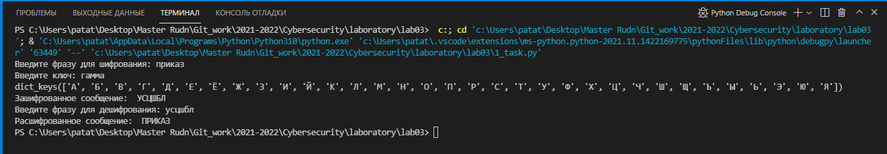

---
# Front matter
lang: ru-RU
title: "Математические основы защиты информации и информационной безопасности"
subtitle: "Отче по лабораторной работе № 3"
author: "Кейела Патачона НПМмд-02-21"

# Formatting
toc-title: "Содержание"
toc: true # Table of contents
toc_depth: 2
lof: true # List of figures
fontsize: 12pt
linestretch: 1.5
papersize: a4paper
documentclass: scrreprt
polyglossia-lang: russian
polyglossia-otherlangs: english
mainfont: PT Serif
romanfont: PT Serif
sansfont: PT Sans
monofont: PT Mono
mainfontoptions: Ligatures=TeX
romanfontoptions: Ligatures=TeX
sansfontoptions: Ligatures=TeX,Scale=MatchLowercase
monofontoptions: Scale=MatchLowercase
indent: true
pdf-engine: lualatex
header-includes:
  - \linepenalty=10 # the penalty added to the badness of each line within a paragraph (no associated penalty node) Increasing the value makes tex try to have fewer lines in the paragraph.
  - \interlinepenalty=0 # value of the penalty (node) added after each line of a paragraph.
  - \hyphenpenalty=50 # the penalty for line breaking at an automatically inserted hyphen
  - \exhyphenpenalty=50 # the penalty for line breaking at an explicit hyphen
  - \binoppenalty=700 # the penalty for breaking a line at a binary operator
  - \relpenalty=500 # the penalty for breaking a line at a relation
  - \clubpenalty=150 # extra penalty for breaking after first line of a paragraph
  - \widowpenalty=150 # extra penalty for breaking before last line of a paragraph
  - \displaywidowpenalty=50 # extra penalty for breaking before last line before a display math
  - \brokenpenalty=100 # extra penalty for page breaking after a hyphenated line
  - \predisplaypenalty=10000 # penalty for breaking before a display
  - \postdisplaypenalty=0 # penalty for breaking after a display
  - \floatingpenalty = 20000 # penalty for splitting an insertion (can only be split footnote in standard LaTeX)
  - \raggedbottom # or \flushbottom
  - \usepackage{float} # keep figures where there are in the text
  - \floatplacement{figure}{H} # keep figures where there are in the text
---

# Цель работы

Изучить алгоритм шифрования гаммированием конечной гаммой.

# Теоретические сведения

## Гаммированием конечной гаммой

Гаммирование — процедура наложения при помощи некоторой функции F на
исходный текст гаммы шифра, т.е. псевдослучайной последовательности (ПСП) с
выходов генератора G. Псевдослучайная поСледовательность по своим
статистическим свойствам неотличима от случайной послеловательности, но
является детерминированной, те. известен алгоритм ее формирования. Чаще
Обычно в качестве функции F берется операция поразрядного сложения по
модулю два или по модулю N (N число букв алфавита открытого текста).

Простейший генератор псевдослучайной  последовательности можно
представить рекуррентным соотношением:

у~i~ = aу~(i-1)~ + b mod(m), i = (1;m),

где у~i~ — i-й член последовательности псевдослучайных чисел, а, y~0~, b — ключевые
параметры. Такая последовательность состоит из целых чисел от 0 до m — 1. Если
элементы у~i~ и у~j~ совпадут, то совпадут и последующие участки. Таким образом, ПСП является периодической. Знание периода гаммы
бущественно облегчает криптоанализ. Максимальная длина периода равна m. Для ее достижения необходимо удовлетворить следующим условиям:

1. b и m — взаимно простые числа;

2. а- 1 делится на любой простой делитель числа m;

3. а- 1 кратно 4, если т кратно 4.

Стойкость шифров, основанных на процедуре гаммирования, зависит от
характеристик гаммы — длины и равномерности распределения вероятностей
появления знаков гаммы.

При использовании генератора ПСП получаем бесконечную гамму. Однако,
возможен режим шифрования конечной гаммы. В роли конечной гаммы может
выступать фраза. Как и ранее, используется алфавитный порядок букв, т. буква
«а» имеет порядковый номер 1, «6» —2 итд.

# Выполнение работы

## Реализация шифра на языке Python

```
# Вводим алфавит и ключ
word_to_encode = input("Введите фразу для шифрования: ").upper()
key_word = input("Введите ключ: ").upper()
# Растягиваем ключ на длину слова 
if len(key_word) < len(word_to_encode):
    k = (len(word_to_encode) % len(key_word))
    key_word = '' + key_word * (len(word_to_encode) // len(key_word)) + key_word[:k]
# Формируем алфвавит и порядковый словарь
alphabet = 'АБВГДЕЁЖЗИЙКЛМНОПРСТУФХЦЧШЩЪЫЬЭЮЯ'
alp_dict = {letter: idx + 1 for idx, letter in enumerate(alphabet)}
# процесс кодировки
encoded_word = ''
for word_letter, key_letter in zip(word_to_encode, key_word):
    encoded_word += list(alp_dict.keys())[(alp_dict[word_letter] + alp_dict[key_letter] % len(alphabet))-1]
print("Зашифрованное сообщение: ", encoded_word)
# процесс декодировки
word_to_decode = input("Введите фразу для дешифрования: ").upper()
decoded_word = ''
for word_letter, key_letter in zip(word_to_decode, key_word):
    decoded_word += list(alp_dict.keys())[(alp_dict[word_letter] - alp_dict[key_letter] % len(alphabet))-1]
print("Расшифрованное сообщение: ", decoded_word)
```

## Контрольный пример

{ #fig:001 width=70% height=70%}


# Выводы

Изучили алгоритм шифрования гаммированием конечной гаммой.

# Список литературы{.unnumbered}

1. [ШИФРЫ ГАММИРОВАНИЯ](https://www.sites.google.com/site/anisimovkhv/learning/kripto/lecture/tema6)
2. [Гаммирование](https://ru.wikipedia.org/wiki/Гаммирование) 

