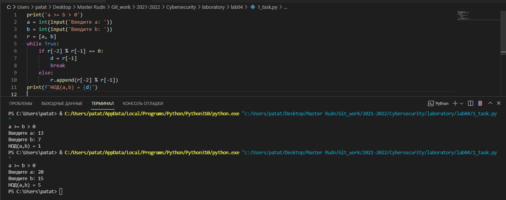
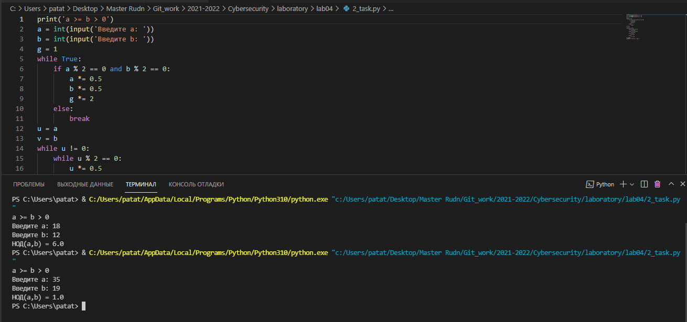
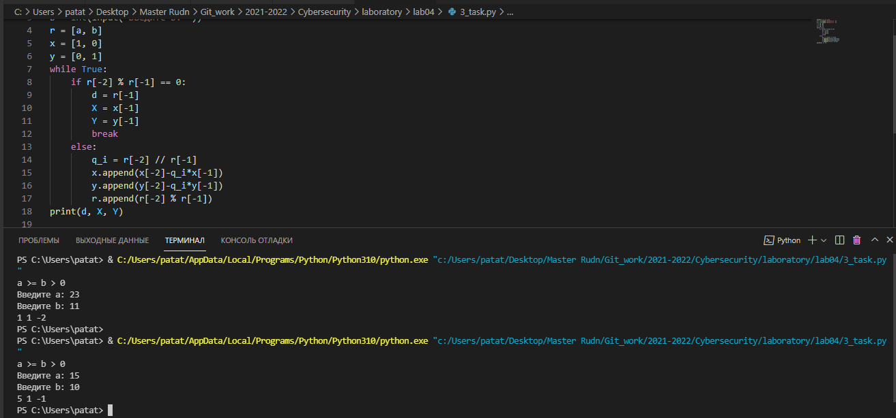
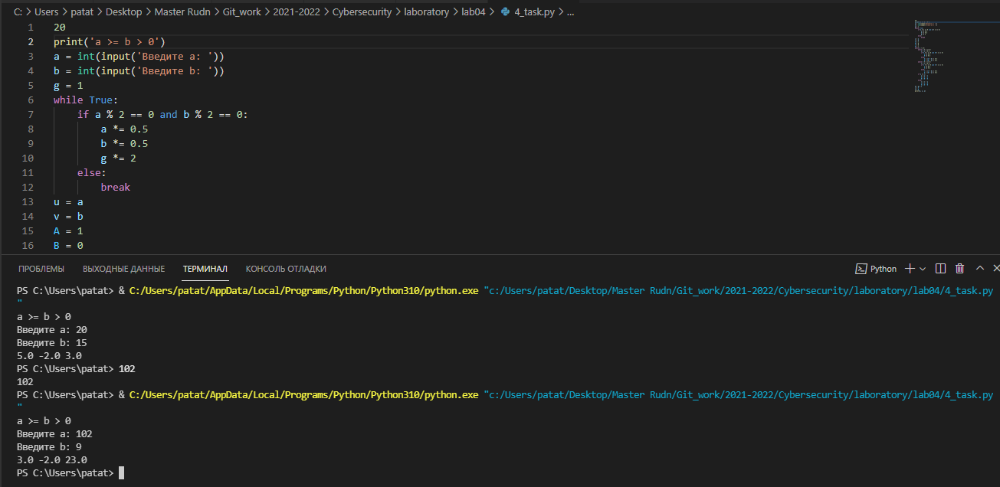

---
## Front matter
lang: ru-RU
title: Алгоритмы Евклида для нахождения НОД.
author: Кейела Патачона
institute: Российский Университет Дружбы Народов
date: 02 декабря, 2021, Москва, Россия

## Formatting
mainfont: PT Serif
romanfont: PT Serif
sansfont: PT Sans
monofont: PT Mono
toc: false
slide_level: 2
theme: metropolis
header-includes: 
 - \metroset{progressbar=frametitle,sectionpage=progressbar,numbering=fraction}
 - '\makeatletter'
 - '\beamer@ignorenonframefalse'
 - '\makeatother'
aspectratio: 43
section-titles: true
---

# Цели и задачи

## Цель лабораторной работы

Изучить алгоритмы для вычисления наибольшего общего делителя.

# Выполнение лабораторной работы

## Алгоритм Евклида

Для вычисления наибольшего общего делителя двух целых чисел применяется способ повторного деления с остатком, называемый алгоритмом Евклида.

Вход. Целые числа a, b; 0 < b < a.
Выход. d = НОД(а,b).

1. Положить r~0~ = а,r~1~ = b,i = 1

2. Найти остаток r~i+1~ от деления r~i-1~ на r~i~ 

3. Если r~i+1~ = 0, то положить d = r~i~. В противном случае положить i = i+1 и
вернуться на шаг 2 

4. Результат: d

## Бинарный  алгоритм Евклида

Бинарный алгоритм Евклида является более быстрым при реализации на компьютере, поскольку использует двоичное представление чисел а и b. Бинарный алгоритм Евклида основан на следующих свойствах наибольшего общего делителя (считаем, что 0 <Ь < а):

1. если оба числа а и b четные, то НОД(а,b) = 2 НОД(а/2,b/2)

2. если число а - нечетное, число b — четное, то НОД(а,Ь) = НОД(а, b/2)

3. если оба числа а и b нечетные, а > b, то НОД(а,b) = НОД(а - b,b)

4. если а = b , то НОД(а,b) = a

## Расширенный алгоритм Евклида и Бинарный алгоритм Евклида

Данные алгоритмы  Евклида находят, помимо g = НОД(a, b) такие целые коэффициенты x и y, что:

```
ax +by =d
```

Заметим, что решений бесконечно много: имея решение (x, y), можно x увеличить на b, а y уменьшить на a, и равенство при этом не изменится.

## Контрольные примеры 

{ #fig:001 width=70% height=70%}

{ #fig:002 width=70% height=70%}

## Контрольные примеры

{ #fig:003 width=70% height=70%}

{ #fig:004 width=70% height=70%}

# Выводы

## Результаты выполнения лабораторной работы

Мной были узчены алгоритмы для вычисления наибольшего общего делителя Евклида.