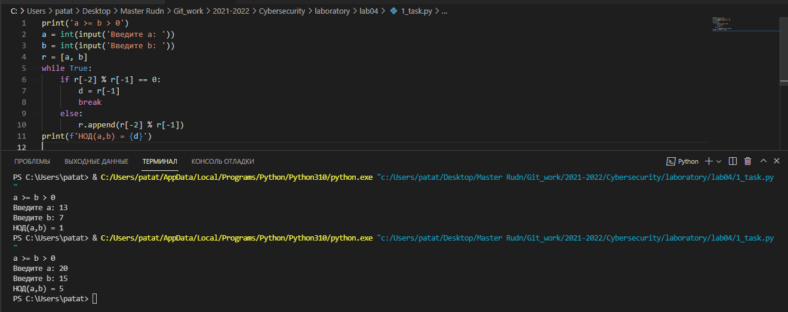
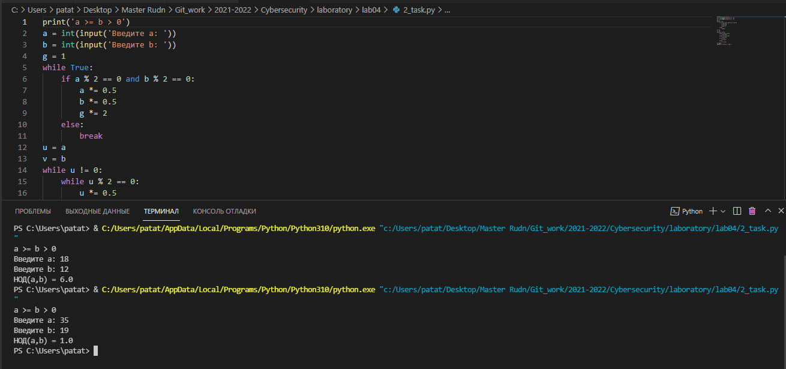
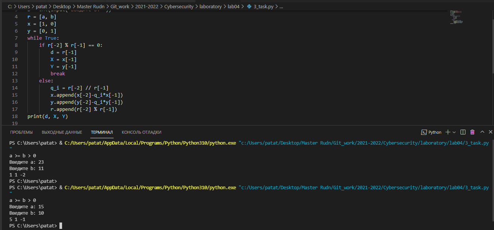
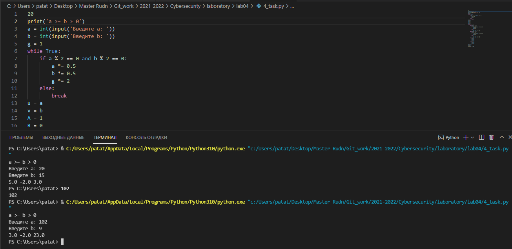

---
# Front matter
lang: ru-RU
title: "Математические основы защиты информации и информационной безопасности"
subtitle: "Отчет по лабораторной работе № 4"
author: "Кейела Патачона НПМмд-02-21"

# Formatting
toc-title: "Содержание"
toc: true # Table of contents
toc_depth: 2
lof: true # List of figures
fontsize: 12pt
linestretch: 1.5
papersize: a4paper
documentclass: scrreprt
polyglossia-lang: russian
polyglossia-otherlangs: english
mainfont: PT Serif
romanfont: PT Serif
sansfont: PT Sans
monofont: PT Mono
mainfontoptions: Ligatures=TeX
romanfontoptions: Ligatures=TeX
sansfontoptions: Ligatures=TeX,Scale=MatchLowercase
monofontoptions: Scale=MatchLowercase
indent: true
pdf-engine: lualatex
header-includes:
  - \linepenalty=10 # the penalty added to the badness of each line within a paragraph (no associated penalty node) Increasing the value makes tex try to have fewer lines in the paragraph.
  - \interlinepenalty=0 # value of the penalty (node) added after each line of a paragraph.
  - \hyphenpenalty=50 # the penalty for line breaking at an automatically inserted hyphen
  - \exhyphenpenalty=50 # the penalty for line breaking at an explicit hyphen
  - \binoppenalty=700 # the penalty for breaking a line at a binary operator
  - \relpenalty=500 # the penalty for breaking a line at a relation
  - \clubpenalty=150 # extra penalty for breaking after first line of a paragraph
  - \widowpenalty=150 # extra penalty for breaking before last line of a paragraph
  - \displaywidowpenalty=50 # extra penalty for breaking before last line before a display math
  - \brokenpenalty=100 # extra penalty for page breaking after a hyphenated line
  - \predisplaypenalty=10000 # penalty for breaking before a display
  - \postdisplaypenalty=0 # penalty for breaking after a display
  - \floatingpenalty = 20000 # penalty for splitting an insertion (can only be split footnote in standard LaTeX)
  - \raggedbottom # or \flushbottom
  - \usepackage{float} # keep figures where there are in the text
  - \floatplacement{figure}{H} # keep figures where there are in the text
---

# Цель работы

Изучить алгоритмы для вычисления наибольшего общего делителя.

# Теоретические сведения

## Алгоритм Евклида

Для вычисления наибольшего общего делителя двух целых чисел применяется способ повторного деления с остатком, называемый алгоритмом Евклида.

*Алгоритм Евклида.*

Вход. Целые числа a, b; 0 < b < a.

Выход. d = НОД(а,b).

1. Положить r~0~ = а,r~1~ = b,i = 1

2. Найти остаток r~i+1~ от деления r~i-1~ на r~i~ 

3. Если r~i+1~ = 0, то положить d = r~i~. В противном случае положить i = i+1 и
вернуться на шаг 2 

4. Результат: d

## Бинарный  алгоритм Евклида

Бинарный алгоритм Евклида является более быстрым при реализации на компьютере, поскольку использует двоичное представление чисел а и b. Бинарный алгоритм Евклида основан на следующих свойствах наибольшего общего делителя (считаем, что 0 <Ь < а):

1. если оба числа а и b четные, то НОД(а,b) = 2 НОД(а/2,b/2)

2. если число а - нечетное, число b — четное, то НОД(а,Ь) = НОД(а, b/2)

3. если оба числа а и b нечетные, а > b, то НОД(а,b) = НОД(а - b,b)

4. если а = b , то НОД(а,b) = a

## Расширенный алгоритм Евклида и Бинарный алгоритм Евклида

Данные алгоритмы  Евклида находят, помимо g = НОД(a, b) такие целые коэффициенты x и y, что:

```
ax +by =d
```

Заметим, что решений бесконечно много: имея решение (x, y), можно x увеличить на b, а y уменьшить на a, и равенство при этом не изменится.
С полным алгоритмом вы можете ознакомится в инструкции к лабораторной работе №4

# Выполнение работы

## Реализация алгоритмов  на языке Python

*Алгоритм Евклида*
```
print('a >= b > 0')
a = int(input('Введите a: '))
b = int(input('Введите b: '))
r = [a, b]
while True:
    if r[-2] % r[-1] == 0:
        d = r[-1]
        break
    else:
        r.append(r[-2] % r[-1])
print(f'НОД(a,b) = {d}')
```

*Бинарный алгоритм Евклида*
```
print('a >= b > 0')
a = int(input('Введите a: '))
b = int(input('Введите b: '))
g = 1
while True:
    if a % 2 == 0 and b % 2 == 0:
        a *= 0.5
        b *= 0.5
        g *= 2
    else:
        break
u = a
v = b
while u != 0:
    while u % 2 == 0:
        u *= 0.5
    while v % 2 == 0:
        v *= 0.5
    if u >= v:
        u = u-v
    else:
        v = v-u
d = g*v
print(f'НОД(a,b) = {d}')
```

*Расширенный алгоритм Евклида*
```
print('a >= b > 0')
a = int(input('Введите a: '))
b = int(input('Введите b: '))
r = [a, b]
x = [1, 0]
y = [0, 1]
while True:
    if r[-2] % r[-1] == 0:
        d = r[-1]
        X = x[-1]
        Y = y[-1]
        break
    else:
        q_i = r[-2] // r[-1]
        x.append(x[-2]-q_i*x[-1])
        y.append(y[-2]-q_i*y[-1])
        r.append(r[-2] % r[-1])
print(d, X, Y)
```
*Расширенный бинарный алгоритм Евклида*
```
print('a >= b > 0')
a = int(input('Введите a: '))
b = int(input('Введите b: '))
g = 1
while True:
    if a % 2 == 0 and b % 2 == 0:
        a *= 0.5
        b *= 0.5
        g *= 2
    else:
        break
u = a
v = b
A = 1
B = 0
C = 0
D = 1
while u != 0:
    while u % 2 == 0:
        u = u * 0.5
        if A % 2 == 0 and B % 2 == 0:
            A *= 0.5
            B *= 0.5
        else:
            A = (A + b) * 0.5
            B = (B - a) * 0.5
    while v % 2 == 0:
        v = v * 0.5
        if C % 2 == 0 and D % 2 == 0:
            C *= 0.5
            D *= 0.5
        else:
            C = (C + b) * 0.5
            D = (D - a) * 0.5
    if u >= v:
        u = u - v
        A = A - C
        B = B - D
    else:
        v = v - u
        C = C - A
        D = D - B
d = g * v
x = C
y = D
print(d, x, y)
```

## Контрольный пример

{ #fig:001 width=70% height=70%}

{ #fig:002 width=70% height=70%}

{ #fig:003 width=70% height=70%}

{ #fig:004 width=70% height=70%}


# Выводы

Мной были узчены алгоритмы для вычисления наибольшего общего делителя Евклида.

# Список литературы{.unnumbered}

1. [Алгоритмы Евклида](http://ikit.edu.sfu-kras.ru/files/15/l2.pdf)
2. [Инструкция к лабораторной работе №4](https://esystem.rudn.ru/pluginfile.php/1283445/mod_folder/content/0/lab04.pdf?forcedownload=1)

