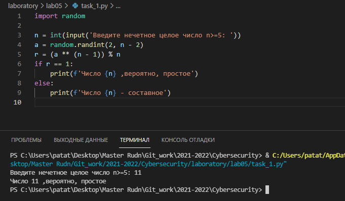
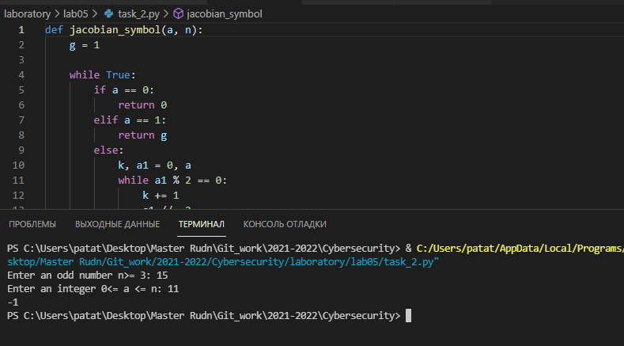
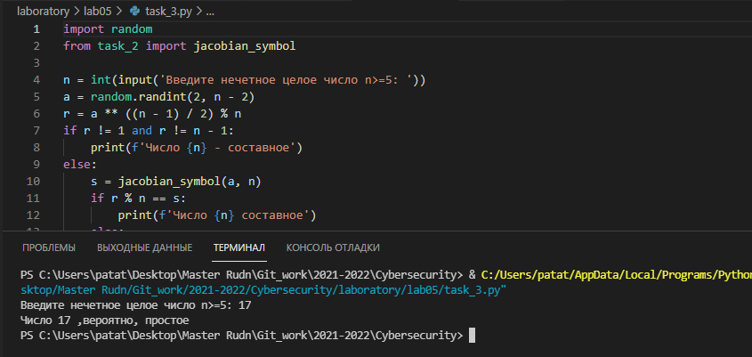
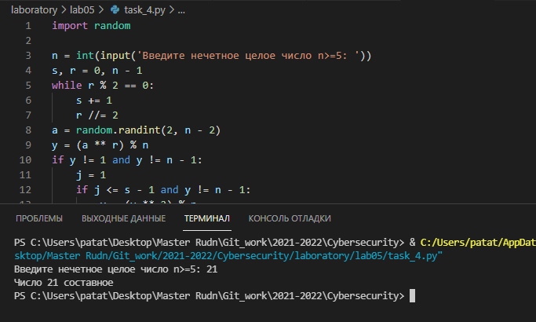

---
# Front matter
lang: ru-RU
title: "Математические основы защиты информации и информационной безопасности"
subtitle: "Отчет по лабораторной работе № 5"
author: "Кейела Патачона НПМмд-02-21"

# Formatting
toc-title: "Содержание"
toc: true # Table of contents
toc_depth: 2
lof: true # List of figures
fontsize: 12pt
linestretch: 1.5
papersize: a4paper
documentclass: scrreprt
polyglossia-lang: russian
polyglossia-otherlangs: english
mainfont: PT Serif
romanfont: PT Serif
sansfont: PT Sans
monofont: PT Mono
mainfontoptions: Ligatures=TeX
romanfontoptions: Ligatures=TeX
sansfontoptions: Ligatures=TeX,Scale=MatchLowercase
monofontoptions: Scale=MatchLowercase
indent: true
pdf-engine: lualatex
header-includes:
  - \linepenalty=10 # the penalty added to the badness of each line within a paragraph (no associated penalty node) Increasing the value makes tex try to have fewer lines in the paragraph.
  - \interlinepenalty=0 # value of the penalty (node) added after each line of a paragraph.
  - \hyphenpenalty=50 # the penalty for line breaking at an automatically inserted hyphen
  - \exhyphenpenalty=50 # the penalty for line breaking at an explicit hyphen
  - \binoppenalty=700 # the penalty for breaking a line at a binary operator
  - \relpenalty=500 # the penalty for breaking a line at a relation
  - \clubpenalty=150 # extra penalty for breaking after first line of a paragraph
  - \widowpenalty=150 # extra penalty for breaking before last line of a paragraph
  - \displaywidowpenalty=50 # extra penalty for breaking before last line before a display math
  - \brokenpenalty=100 # extra penalty for page breaking after a hyphenated line
  - \predisplaypenalty=10000 # penalty for breaking before a display
  - \postdisplaypenalty=0 # penalty for breaking after a display
  - \floatingpenalty = 20000 # penalty for splitting an insertion (can only be split footnote in standard LaTeX)
  - \raggedbottom # or \flushbottom
  - \usepackage{float} # keep figures where there are in the text
  - \floatplacement{figure}{H} # keep figures where there are in the text
---

# Цель работы

Изучить вероятностные алгоритмы проверки чисел на простоту.

# Теоретические сведения

## Тест Ферма
 
Вход. Нечетное целое цисло n>=5.

Выход. "Число n,вероятно,простое" или "Число n составное".

1. Выбрать случайное целое число a, 2<=a<=2.

2. Вычислить r = a^(n-1)^(mod n).

3. Если r = 0 результат :  "Число n,вероятно,простое".В противном случае результат: "Число n составное".


## Символ Якоби

Вход. Нечетное целое цисло n>=3, целое число а,0 <= a < n.

Выход. Символ Якоби.

1. g=1

2. если a =0 результат: 0

3. если a =1 результат: g

4. прадствить а в виде a = 2^k^a~1 , где a~1~ нечетное.

5. при четном k положить s=1, при нечетном положить s=1, если n=abs(1(mod8));положить s=-1, если n=abs(3(mod8))

6. при a~1~ результат: gs

7. если n = 3(mod4) and a~1~ = 3(mod4) , то s = -s

8. положить a = n mod(a~1~) n = a~1~ g = gs и вернуться на шаг 2

## Алгоритм , реализующий тест Соловея - Штрассена

Вход. Нечетное целое цисло n>=5.

Выход. "Число n,вероятно,простое" или "Число n составное".

1. Выбрать случайное целое число a, 2<=a<=2.

2. Вычислить r = a^(n+1)/2^(mod n)

3. Если r не равен 1 и n-1 реузультат: "Число n составное".

4. Вычислить символ Якоби s = (a/n)

5. Если r = s(mod n) реузультат: "Число n составное", иначе "Число n,вероятно,простое".

## Алгоритм , реализующий тест Миллера - Рабина

Вход. Нечетное целое цисло n>=5.

Выход. "Число n,вероятно,простое" или "Число n составное".

1. представить n-1 в виде n-1 = 2^s^r , где r нечетное

2. выбрать случайное целое число a, 2<=a<=2

3. вычислить y = a^r^(mod n)

4. при y не равном 1 и n-1 выполнить следующее

4.1. положить j = 1 

	4.2. если j <= s-1 и y не равен n-1 ,то

		4.2.1. положить y = y^2^(mod n)
		
		4.2.2. при y = 1 результат: "Число n составное"
		
		4.2.3. положить j = j+1
		
	4.3. при y не равном n-1 результат: "Число n составное"
	
5. Результат: "Число n,вероятно,простое"

# Выполнение работы

## Реализация алгоритмов  на языке Python

*Тест Ферма*
```
import random

n = int(input('Введите нечетное целое число n>=5: '))
a = random.randint(2, n - 2)
r = (a ** (n - 1)) % n
if r == 1:
    print(f'Число {n} ,вероятно, простое')
else:
    print(f'Число {n} - составное')
```

*Символ Якоби*
```
def jacobian_symbol(a, n):
    g = 1

    while True:
        if a == 0:
            return 0
        elif a == 1:
            return g
        else:
            k, a1 = 0, a
            while a1 % 2 == 0:
                k += 1
                a1 //= 2
            if k % 2 == 0:
                s = 1
            else:
                if abs(n % 8) == 1:
                    s = 1
                else:
                    s = -1
            if a1 == 1:
                return g * s
            if n % 4 == 3 and a1 % 4 == 3:
                s *= -1
            a = n % a1
            n = a1
            g = g * s


if __name__ == "__main__":
    n = int(input("Enter an odd number n>= 3: "))
    a = int(input("Enter an integer 0<= a <= n: "))
    print(jacobian_symbol(a, n))
```

*Алгоритм , реализующий тест Соловея - Штрассена*
```
import random
from task_2 import jacobian_symbol

n = int(input('Введите нечетное целое число n>=5: '))
a = random.randint(2, n - 2)
r = a ** ((n - 1) / 2) % n
if r != 1 and r != n - 1:
    print(f'Число {n} - составное')
else:
    s = jacobian_symbol(a, n)
    if r % n == s:
        print(f'Число {n} составное')
    else:
        print(f'Число {n} ,вероятно, простое')
```
*Алгоритм , реализующий тест Миллера - Рабина*
```
import random

n = int(input('Введите нечетное целое число n>=5: '))
s, r = 0, n - 1
while r % 2 == 0:
    s += 1
    r //= 2
a = random.randint(2, n - 2)
y = (a ** r) % n
if y != 1 and y != n - 1:
    j = 1
    if j <= s - 1 and y != n - 1:
        y = (y ** 2) % n
        if y==1:
            print(f'Число {n} составное')
        j +=1
    if y != n - 1:
        print(f'Число {n} составное')
else:
    print(f'Число {n} ,вероятно, простое')
```

## Контрольный пример

{ #fig:001 width=70% height=70%}

{ #fig:002 width=70% height=70%}

{ #fig:003 width=70% height=70%}

{ #fig:004 width=70% height=70%}


# Выводы

Мной были узчены вероятностные алгоритмы  проверки чисел на простоту.

# Список литературы{.unnumbered}

1. [Инструкция к лабораторной работе №5](https://esystem.rudn.ru/pluginfile.php/1283452/mod_folder/content/0/lab05.pdf?forcedownload=1)

