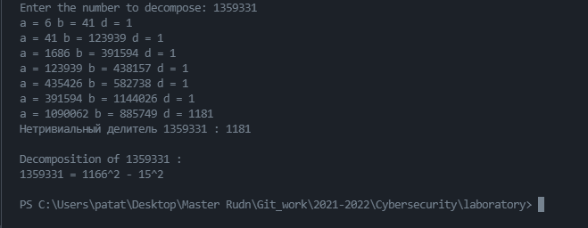

---
## Front matter
lang: ru-RU
title: Лабораторная работа №6.
author: Кейела Патачона, НПМмд-02-21
institute: РУДН, Москва, Россия

date: 17 декабря 2021

## Formatting
mainfont: PT Serif
romanfont: PT Serif
sansfont: PT Sans
monofont: PT Mono
toc: false
slide_level: 2
theme: metropolis
header-includes: 
 - \metroset{progressbar=frametitle,sectionpage=progressbar,numbering=fraction}
 - '\makeatletter'
 - '\beamer@ignorenonframefalse'
 - '\makeatother'
aspectratio: 43
section-titles: true
---

# Цель работы

***Цель работы:*** Построить алгоритм, реализующий разложение чисел на множетели.

# Разложение чисел на множители

Задача разложения на множители - одна из первых задач, использованных для построения криптосистем с открытым ключом.
*Задача разложения составного числа на множители* формулируется следующим образом: для данного положительного целого числа $n$ найти его каноническое разложение $n={p_1}^{α_1}{p_2}^{α_2}...{p_s}^{α_s}$, где $p_i$ — попарно различные простые числа, $α_i \geq 1$.
На практике не обязательно находить каноническое разложение числа $n$. Достаточно найти его разложение на *два нетривиальных сомложителя*: $n=pq, 1≤p≤q<n$. Далее будем понимать задачу разложения именно в этом смысле.

## $p-$Метод Полларда

Пусть $n$ — нечетное составное число, $S = \{ 0, 1,...,n – 1 \}$ и $f:S → S -$ случайное отображение, обладающее сжимающими свойствами, например $f(x) = x^2 + 1 (mod \quad n)$. Основная идея метода состоит в следующем. Выбираем случайный элемент $x_0 \in S$ и строим последовательность $x_0, x_1, x_2,...,$ определяемую рекуррентным соотношением $x_{i+1} = f(x_i)$ где $i>0$, до тех пор, пока не найдем такие числа $i,j,$ что $i<j$ и $x_i = x_j$. Поскольку множество $S$ конечно, такие индексы $i,j$ существуют (последовательность «зацикливается»). Последовательность ${x_i}$ будет состоять из «хвоста» $x_0, x_1, ...,x_{i-1}$ длины $O\left(\sqrt{\frac{\pi n}{8}}\right)$ и цикла $x_i = x_j, x_{i+1},..., x_{j-1}$ той же длины.

## Алгоритм, реализующий $p-$метод Полларда 

***Вход***. Число $n$, начальное значение $c$, функция $f$, обладающая сжимающими свойствами.

***Выход***. Нетривиальный делитель числа $n$.

1. Положить $a \leftarrow c, b \leftarrow c$.
   
2. Вычислить $a \leftarrow f(a)(mod \quad n), b \leftarrow f(f(b)) (mod \quad n)$

3. Найти $d ←$ НОД $(a-b,n)$.

4. Если $1 <  d < n$, то положить $p \leftarrow d$ и результат $p$. При $d = n$ результат: "Делитель не найден"; при $d = 1$ ввернуться на шаг 2.

## Алгоритм, реализующий $p-$метод Полларда  
{ #fig:01 width=75% height=75% }

## Метод квадратов. (Теорема Ферма о разложении)
Для любого положительного нечетного числа $n$, существует взаимно однозначное соответствие между множеством делителей числа $n$, не меньших, чем $\sqrt{n}$, и множеством пар ${s,t}$ таких неотрицательных целых чисел, что $n = s^2 - t^2$.
{ #fig:02 width=35% height=35% }

# Выводы

 В ходе этой лабораторной работы, я изучил и построил алгоритм $p-$метода Полларда и научился разложение чисел на множетели и в виде разности квадратов.