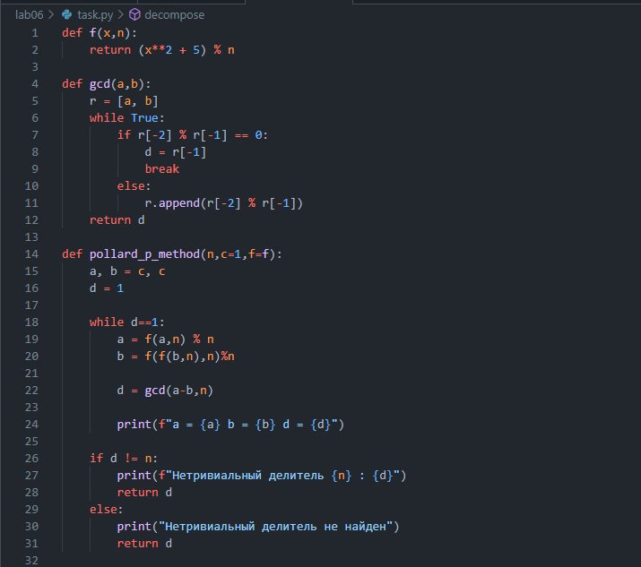
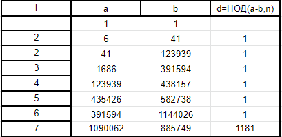
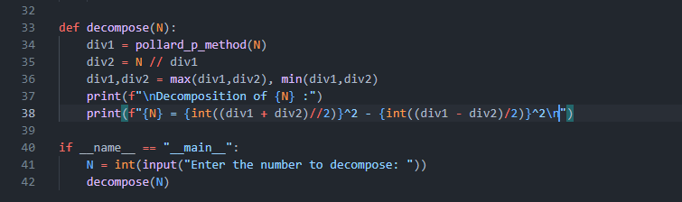
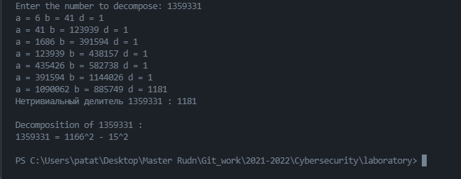
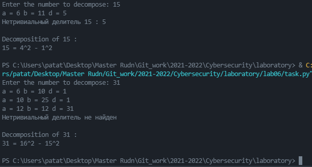

---
# Front matter
lang: ru-RU
title: "Математические основы защиты информации и информационной безопасности"
subtitle: "Отчет по лабораторной работе № 6 : Paложение чисел на множители."
author: "Кейела Патачона, группа НПМмд-02-21"

# Formatting
toc-title: "Содержание"
toc: true # Table of contents
toc_depth: 2
lof: true # List of figures
fontsize: 12pt
linestretch: 1.5
papersize: a4paper
documentclass: scrreprt
polyglossia-lang: russian
polyglossia-otherlangs: english
mainfont: PT Serif
romanfont: PT Serif
sansfont: PT Sans
monofont: PT Mono
mainfontoptions: Ligatures=TeX
romanfontoptions: Ligatures=TeX
sansfontoptions: Ligatures=TeX,Scale=MatchLowercase
monofontoptions: Scale=MatchLowercase
indent: true
pdf-engine: lualatex
header-includes:
  - \linepenalty=10 # the penalty added to the badness of each line within a paragraph (no associated penalty node) Increasing the value makes tex try to have fewer lines in the paragraph.
  - \interlinepenalty=0 # value of the penalty (node) added after each line of a paragraph.
  - \hyphenpenalty=50 # the penalty for line breaking at an automatically inserted hyphen
  - \exhyphenpenalty=50 # the penalty for line breaking at an explicit hyphen
  - \binoppenalty=700 # the penalty for breaking a line at a binary operator
  - \relpenalty=500 # the penalty for breaking a line at a relation
  - \clubpenalty=150 # extra penalty for breaking after first line of a paragraph
  - \widowpenalty=150 # extra penalty for breaking before last line of a paragraph
  - \displaywidowpenalty=50 # extra penalty for breaking before last line before a display math
  - \brokenpenalty=100 # extra penalty for page breaking after a hyphenated line
  - \predisplaypenalty=10000 # penalty for breaking before a display
  - \postdisplaypenalty=0 # penalty for breaking after a display
  - \floatingpenalty = 20000 # penalty for splitting an insertion (can only be split footnote in standard LaTeX)
  - \raggedbottom # or \flushbottom
  - \usepackage{float} # keep figures where there are in the text
  - \floatplacement{figure}{H} # keep figures where there are in the text
---

# Цель работы

Построить алгоритм, реализующий разложение чисел на множетели.

# Выполнение работы

Задача разложения на множители - одна из первых задач, использованных для построения криптосистем с открытым ключом.
*Задача разложения составного числа на множители* формулируется следующим образом: для данного положительного целого числа $n$ найти его каноническое разложение $n={p_1}^{α_1}{p_2}^{α_2}...{p_s}^{α_s}$, где $p_i$ — попарно различные простые числа, $α_i \geq 1$.
На практике не обязательно находить каноническое разложение числа $n$. Достаточно найти его разложение на *два нетривиальных сомложителя*: $n=pq, 1≤p≤q<n$. Далее будем понимать задачу разложения именно в этом смысле.

## $p-$Метод Полларда

Пусть $n$ — нечетное составное число, $S = \{ 0, 1,...,n – 1 \}$ и $f:S → S -$ случайное отображение, обладающее сжимающими свойствами, например $f(x) = x^2 + 1 (mod \quad n)$. Основная идея метода состоит в следующем. Выбираем случайный элемент $x_0 \in S$ и строим последовательность $x_0, x_1, x_2,...,$ определяемую рекуррентным соотношением

$$
x_{i+1} = f(x_i)
$$

где $i>0$, до тех пор, пока не найдем такие числа $i,j,$ что $i<j$ и $x_i = x_j$. Поскольку множество $S$ конечно, такие индексы $i,j$ существуют (последовательность «зацикливается»). Последовательность ${x_i}$ будет состоять из «хвоста» $x_0, x_1, ...,x_{i-1}$ длины $O\left(\sqrt{\frac{\pi n}{8}}\right)$ и цикла $x_i = x_j, x_{i+1},..., x_{j-1}$ той же длины.

## Алгоритм, реализующий $p-$метод Полларда. 

***Вход***. Число $n$, начальное значение $c$, функция $f$, обладающая сжимающими свойствами.

***Выход***. Нетривиальный делитель числа $n$.

1. Положить $a \leftarrow c, b \leftarrow c$.
   
2. Вычислить $a \leftarrow f(a)(mod \quad n), b \leftarrow f(f(b)) (mod \quad n)$

3. Найти $d ←$ НОД $(a-b,n)$.

4. Если $1 <  d < n$, то положить $p \leftarrow d$ и результат $p$. При $d = n$ результат: "Делитель не найден"; при $d = 1$ ввернуться на шаг 2.
   
{ #fig:01 width=75% height=75% }

***Пример***
Найти $p-$метод Полларда нетривиальный делитель числа $n=1359331$. Положим $c=1$ и $f(x)=x^2+5(mod \quad n)$. Работа алгоритма иллюстрируется следующей таблицей:

Таким образом, 1181 является нетривиальным делителем числа 1359331.

## Метод квадратов. (Теорема Ферма о разложении)
Для любого положительного нечетного числа $n$, существует взаимно однозначное соответствие между множеством делителей числа $n$, не меньших, чем $\sqrt{n}$, и множеством пар ${s,t}$ таких неотрицательных целых чисел, что $n = s^2 - t^2$.

***Пример.***
У числа 15 два делителя, не меньших, чем $\sqrt{15}$, - это числа 5 и 15. Тогда получаем два представления:
1. $15=pq=3*5$, откуда $s=4,t=1, 15 = 4^2 - 1^2$;
2. $15 = pq = 1*5$, откуда $s=8,t=7, 15 = 8^2 - 7^2$.

{ #fig:02 width=75% height=75% }

## Результаты работы

{ #fig:03 width=75% height=75% }

{ #fig:04 width=75% height=75% }

# Выводы

В ходе этой лабораторной работы, я изучил и построил алгоритм $p-$ метода Полларда и научился разложение чисел на множетели и в виде разности квадратов.

# Список литературы{.unnumbered}

1. [Инструкция к лабораторной работе №6](https://esystem.rudn.ru/pluginfile.php/1283452/mod_folder/content/0/lab06.pdf?forcedownload=1)
