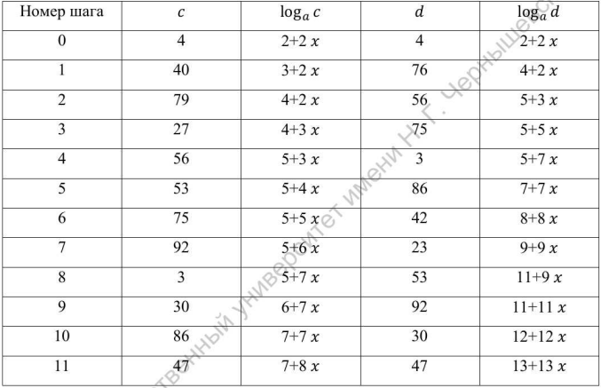
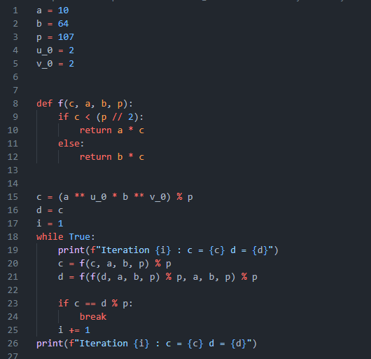
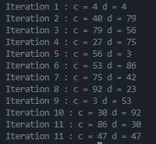

---
## Front matter
lang: ru-RU
title: Дискретное логарифмирование в конечном поле
author: Кейела Патачона
institute: Российский Университет Дружбы Народов
date: 25 декабря, 2021, Москва, Россия

## Formatting
mainfont: PT Serif
romanfont: PT Serif
sansfont: PT Sans
monofont: PT Mono
toc: false
slide_level: 2
theme: metropolis
header-includes: 
 - \metroset{progressbar=frametitle,sectionpage=progressbar,numbering=fraction}
 - '\makeatletter'
 - '\beamer@ignorenonframefalse'
 - '\makeatother'
aspectratio: 43
section-titles: true
---

# Цель и задание работы

***Цель***

Научиться дискретному логарифмированию в конечном поле

***Задания к лабораторной работе***

1. Реализовать алгоритм программно.
2. Получить у преподавателя задание, содержащее числа $p,a,b$ и вычислить логарифм.

# Выполнение лабораторной работы

## Алгоритм, реализующий $p-$Метод Полларда для задач дискретного логарифмирования.

*Вход.* Простое число $p$, число $a$ порядка $r$ по модулю $p$, целое число $b$, $1<b<p$; отображение $f$, обладающее сжимающими свойствами и сохраняющее вычислимость логарифма. 

*Выход.* Показатель $x$, для которого $a^x≡b$*(mod p)*, если такой показатель существует.
1. Выбрать произвольные целые числа $u,v$ положить $c ← a^u b^v$*(mod p)*, $d←c$
2. Выполнять $c ← f(c)$*(mod p)*, $d←f(f(c))$*(mod p)*, вычисляя при этом логарифмы для $c$ и $d$ как линейные функции от $x$ по модулю $r$, до получения равенства $c≡d$*(mod p)*. 
3. Приравняв логарифмы для $c$ и $d$, вычислить логарифм $x$ решением сравнения по модулю $r$. Результат: $x$ или "Решений нет".
   
$$ f(c) =
    \begin{cases}
        ac & \text{при $c<\frac{p}{2}$}\\
        bc & \text{при $c>\frac{p}{2}$}
    \end{cases}
$$

## Пример реализа
Пример. Решим задачу дискретного логарифмирования  $10^x≡64$*(mod 107)*, используя $p-$Метод Полларда. Порядок числа $10$ по модулю $107$ равен $53$.

Выберем отображение  $f(c)≡10c$*(mod 107)* при $c<53$, $f(c)≡64c$*(mod 107)* при $c≥53$. Пусть $u=2,v=2$. Результаты вычислений запишем в таблицу:

{#fig:01 width=20%, height=20%}

Приравниваем логарифмы, полученные на $11-$м шаге: $7+8x≡13+13x$*(mod 107)*. Решая сравнение первой степени, получаем: $x=20$*(mod 53)*.

Проверка: $10^{20}≡64$*(mod 107)*.

## Алгоритм $p-$Полларда

{#fig:02}

## Резуьтат реализации алгоритма

{#fig:03}

# Выводы

Мной была узчена тема дискретного логарифмирования в конечном поле.