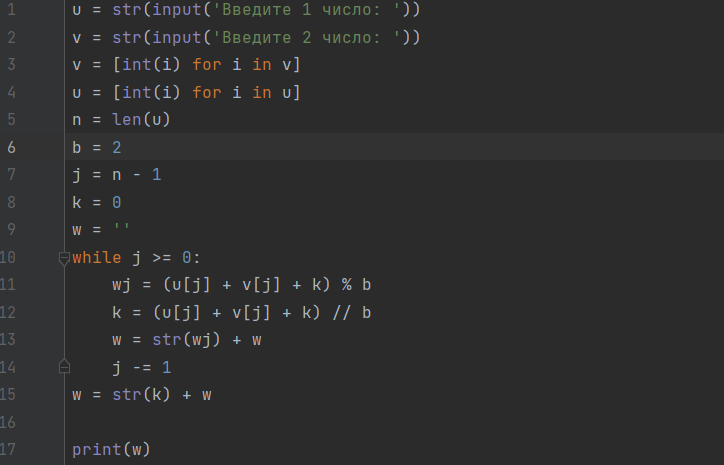
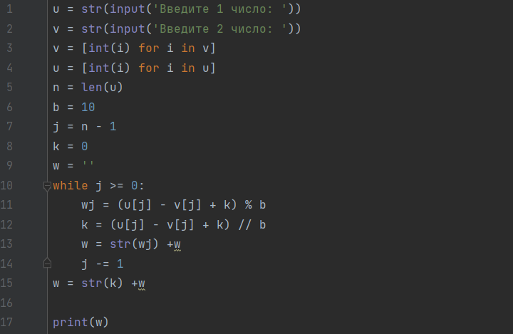
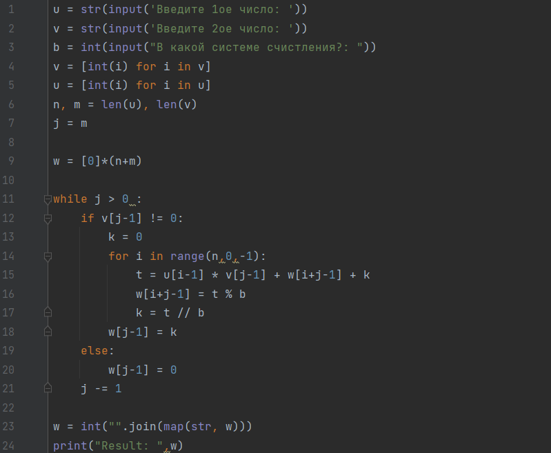
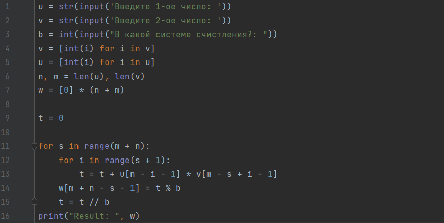
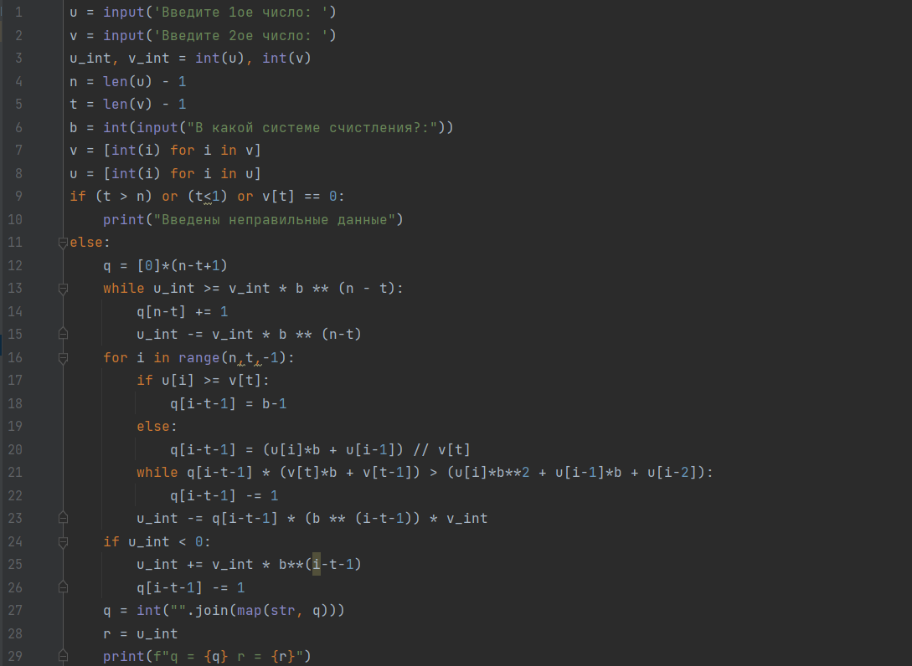
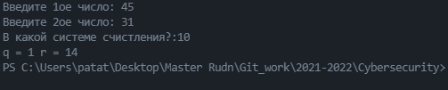

---
## Front matter
lang: ru-RU
title: Целочисленная арифметика многократнй точности.
author: Кейела Патачона
institute: Российский Университет Дружбы Народов
date: 31 декабря, 2021, Москва, Россия

## Formatting
mainfont: PT Serif
romanfont: PT Serif
sansfont: PT Sans
monofont: PT Mono
toc: false
slide_level: 2
theme: metropolis
header-includes: 
 - \metroset{progressbar=frametitle,sectionpage=progressbar,numbering=fraction}
 - '\makeatletter'
 - '\beamer@ignorenonframefalse'
 - '\makeatother'
aspectratio: 43
section-titles: true
---

# Цель работы

Изучить и реализовать следующие алгоритмы: сложения неотрицательны целых чисел, 
вычитание неотрицательны целых чисел, умножение неотрицательны целых чисел столбиком,
алгоритм быстрого столбика и деление многоразрядных целых чисел.

# Теоретические сведения

Описание всех алгоритмов изложено в методическом руководстве к лабораторной работе №8,
которое можно изучить перейдя по ссылке в списке источников.

# Выполнение работы

## Реализация алгоритмов на языке Python

*Алгоритм сложения неотрицательны целых чисел*

## Реализация алгоритмов на языке Python

*Алгоритм вычитания неотрицательны целых чисел*

## Реализация алгоритмов на языке Python

*Алгоритм умножения неотрицательны целых чисел столбиком*

{width=80% height=80%}

## Реализация алгоритмов на языке Python

*Алгоритм быстрого столбика*

## Реализация алгоритмов на языке Python

*Алгоритм деления многоразрядных целых чисел*

{width=80% height=80%}

## Контрольный пример

{ #fig:001 width=70% height=70%}

{ #fig:002 width=70% height=70%}

## Контрольный пример

{ #fig:003 width=70% height=70%}

{ #fig:004 width=70% height=70%}

## Контрольный пример

{ #fig:005 width=70% height=70%}

# Выводы

Мной были изучены и реализованы следующие алгоритмы: сложения неотрицательны целых чисел, 
вычитание неотрицательны целых чисел, умножение неотрицательны целых чисел столбиком,
алгоритм быстрого столбика и деление многоразрядных целых чисел.

# Список литературы{.unnumbered}

1. [Инструкция к лабораторной работе №8](https://esystem.rudn.ru/pluginfile.php/1283473/mod_folder/content/0/lab08.pdf?forcedownload=1)