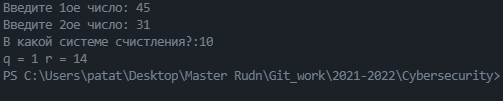

---
# Front matter
lang: ru-RU
title: "Математические основы защиты информации и информационной безопасности"
subtitle: "Отчет по лабораторной работе № 8"
author: "Кейела Патачона НПМмд-02-21"

# Formatting
toc-title: "Содержание"
toc: true # Table of contents
toc_depth: 2
lof: true # List of figures
fontsize: 12pt
linestretch: 1.5
papersize: a4paper
documentclass: scrreprt
polyglossia-lang: russian
polyglossia-otherlangs: english
mainfont: PT Serif
romanfont: PT Serif
sansfont: PT Sans
monofont: PT Mono
mainfontoptions: Ligatures=TeX
romanfontoptions: Ligatures=TeX
sansfontoptions: Ligatures=TeX,Scale=MatchLowercase
monofontoptions: Scale=MatchLowercase
indent: true
pdf-engine: lualatex
header-includes:
  - \linepenalty=10 # the penalty added to the badness of each line within a paragraph (no associated penalty node) Increasing the value makes tex try to have fewer lines in the paragraph.
  - \interlinepenalty=0 # value of the penalty (node) added after each line of a paragraph.
  - \hyphenpenalty=50 # the penalty for line breaking at an automatically inserted hyphen
  - \exhyphenpenalty=50 # the penalty for line breaking at an explicit hyphen
  - \binoppenalty=700 # the penalty for breaking a line at a binary operator
  - \relpenalty=500 # the penalty for breaking a line at a relation
  - \clubpenalty=150 # extra penalty for breaking after first line of a paragraph
  - \widowpenalty=150 # extra penalty for breaking before last line of a paragraph
  - \displaywidowpenalty=50 # extra penalty for breaking before last line before a display math
  - \brokenpenalty=100 # extra penalty for page breaking after a hyphenated line
  - \predisplaypenalty=10000 # penalty for breaking before a display
  - \postdisplaypenalty=0 # penalty for breaking after a display
  - \floatingpenalty = 20000 # penalty for splitting an insertion (can only be split footnote in standard LaTeX)
  - \raggedbottom # or \flushbottom
  - \usepackage{float} # keep figures where there are in the text
  - \floatplacement{figure}{H} # keep figures where there are in the text
---

# Цель работы

Изучить и реализовать следующие алгоритмы: сложения неотрицательны целых чисел, 
вычитание неотрицательны целых чисел, умножение неотрицательны целых чисел столбиком,
алгоритм быстрого столбика и деление многоразрядных целых чисел.

# Теоретические сведения

Описание всех алгоритмов изложено в методическом руководстве к лабораторной работе №8,
которое можно изучить перейдя по ссылке в списке источников.

# Выполнение работы

## Реализация алгоритмов на языке Python

*Алгоритм сложения неотрицательны целых чисел*
```
u = str(input('Введите 1 число: '))
v = str(input('Введите 2 число: '))
v = [int(i) for i in v]
u = [int(i) for i in u]
n = len(u)
b = 2
j = n - 1
k = 0
w = ''
while j >= 0:
    wj = (u[j] + v[j] + k) % b
    k = (u[j] + v[j] + k) // b
    w = str(wj) + w
    j -= 1
w = str(k) + w

print(w)		
```

*Алгоритм вычитания неотрицательны целых чисел*
```
u = str(input('Введите 1 число: '))
v = str(input('Введите 2 число: '))
v = [int(i) for i in v]
u = [int(i) for i in u]
n = len(u)
b = 10
j = n - 1
k = 0
w = ''
while j >= 0:
    wj = (u[j] - v[j] + k) % b
    k = (u[j] - v[j] + k) // b
    w = str(wj) +w
    j -= 1
w = str(k) +w

print(w)		
```

*Алгоритм умножения неотрицательны целых чисел столбиком*
```
u = str(input('Введите 1ое число: '))
v = str(input('Введите 2ое число: '))
b = int(input("В какой системе счистления?: "))
v = [int(i) for i in v]
u = [int(i) for i in u]
n, m = len(u), len(v)
j = m

w = [0]*(n+m)

while j > 0 :
    if v[j-1] != 0:
        k = 0
        for i in range(n,0,-1):
            t = u[i-1] * v[j-1] + w[i+j-1] + k
            w[i+j-1] = t % b
            k = t // b
        w[j-1] = k
    else:
        w[j-1] = 0
    j -= 1

w = int("".join(map(str, w)))
print("Result: ",w)	
```

*Алгоритм быстрого столбика*
```
u = str(input('Введите 1-ое число: '))
v = str(input('Введите 2-ое число: '))
b = int(input("В какой системе счистления?: "))
v = [int(i) for i in v]
u = [int(i) for i in u]
n, m = len(u), len(v)
w = [0] * (n + m)

t = 0

for s in range(m + n):
    for i in range(s + 1):
        t = t + u[n - i - 1] * v[m - s + i - 1]
    w[m + n - s - 1] = t % b
    t = t // b
print("Result: ", w)	
```

*Алгоритм деления многоразрядных целых чисел*
```
u = input('Введите 1ое число: ')
v = input('Введите 2ое число: ')
u_int, v_int = int(u), int(v)
n = len(u) - 1
t = len(v) - 1
b = int(input("В какой системе счистления?:"))

v = [int(i) for i in v]
u = [int(i) for i in u]


if (t > n) or (t<1) or v[t] == 0:
    print("Введены неправильные данные")
else:
    q = [0]*(n-t+1)
	
    while u_int >= v_int * b ** (n - t):
        q[n-t] += 1
        u_int -= v_int * b ** (n-t)
		
    for i in range(n,t,-1):
        if u[i] >= v[t]:
            q[i-t-1] = b-1
        else:
            q[i-t-1] = (u[i]*b + u[i-1]) // v[t]
        while q[i-t-1] * (v[t]*b + v[t-1]) > (u[i]*b**2 + u[i-1]*b + u[i-2]):
            q[i-t-1] -= 1
        u_int -= q[i-t-1] * (b ** (i-t-1)) * v_int
		
    if u_int < 0:
        u_int += v_int * b**(i-t-1)
        q[i-t-1] -= 1
    
    q = int("".join(map(str, q)))
    r = u_int

    print(f"q = {q} r = {r}")
		
```

## Контрольный пример

{ #fig:001 width=70% height=70%}

{ #fig:002 width=70% height=70%}

{ #fig:003 width=70% height=70%}

{ #fig:004 width=70% height=70%}

{ #fig:005 width=70% height=70%}

# Выводы

Мной были изучены и реализованы следующие алгоритмы: сложения неотрицательны целых чисел, 
вычитание неотрицательны целых чисел, умножение неотрицательны целых чисел столбиком,
алгоритм быстрого столбика и деление многоразрядных целых чисел.

# Список литературы{.unnumbered}

1. [Инструкция к лабораторной работе №8](https://esystem.rudn.ru/pluginfile.php/1283473/mod_folder/content/0/lab08.pdf?forcedownload=1)

